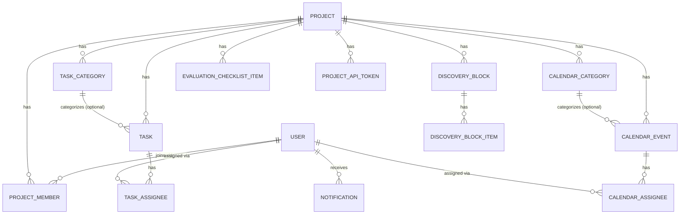
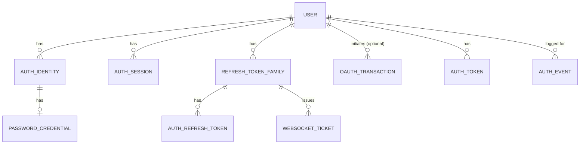

*This project has been created as part of the 42 curriculum by cade-jes, cgajean, diade-so, pafroidu, abelov.*

## Description

**42 Project Planner** is a Trello-like collaborative project management web app for 42 students to plan and track a school project as a team.

Each project gets its own workspace with a Discovery page (lay out the subject before writing code), a Kanban board (split work into tasks, drag them across statuses), a Calendar (deadlines, meetings, everyone's availability), an Evaluation Checklist (track defense readiness against the subject's requirements), and a Summary dashboard pulling live data from all of the above. Multiple team members work in the same project at the same time - task moves, checklist updates, and calendar changes sync live to everyone connected, and notifications keep people informed of changes made while they were away.

Beyond the core project workspace, the app also has user accounts with profiles and avatars, project-level roles and membership, and project-bound API tokens for external integrations.

## Instructions

*To be completed when production instructions are ready.*

## Team Information

- **diade-so** (Diana) - Product Owner: defines the product vision, prioritizes features, maintains the backlog, validates completed work. Also contributes as a developer.
- **pafroidu** (Pauline) - Project Manager: organizes team coordination, tracks progress and deadlines, manages risks and blockers. Also contributes as a developer.
- **abelov** (Andrei) - Technical Lead: makes technology stack and architecture decisions, oversees auth/realtime infrastructure, reviews critical code changes. Also contributes as a developer.
- **cgajean** (Christophe) - Architect: works alongside the Technical Lead on system architecture and cross-cutting technical decisions. Also contributes as a developer.
- **cade-jes** (Carlos) - Developer: implements features and modules, participates in code reviews, tests and documents their work.

## Project Management

### Tools

- **Notion** - the team's shared source of truth: module selection and point tracking, feature breakdown, per-feature implementation pages, and session/decision logs.
- **Figma** - UI prototyping and the design reference for pages and components before they get built.
- **Miro** - whiteboarding for early planning and architecture discussions.
- **GitHub** - code, issues, and pull requests (see workflow below).
- **Discord** - day-to-day communication (see below).

### Git workflow

Each feature is developed on its own branch, with atomic, [Conventional Commits](https://www.conventionalcommits.org/)-style commits (`feat(TR-XX): ...`, `fix(TR-XX): ...`, `chore(TR-XX): ...`), each tagged with the corresponding task ID. Branch protection on `main` requires a pull request before merging - nothing lands directly. In practice, `main`'s history is a straight line of PR merges; the only commits pushed directly are the project's original bootstrap (first commit, `.gitignore`, initial README, issue templates), before the workflow was in place.

A GitHub Actions workflow (`.github/workflows/lint.yml`) runs on every push and pull request: ESLint, Prettier formatting checks, and a build check, for both the frontend and the backend, in parallel jobs. A failing check blocks the PR from looking mergeable, keeping obviously broken or unformatted code out of review.

### Communication

The team runs a dedicated Discord server, organized into channels per domain (frontend, backend, infra/devops, etc.) plus a daily channel for quick async updates. Beyond async communication, the team holds regular sync meetings to review progress, unblock each other, and make joint decisions (module choices, architecture calls, scope changes). Work happens both remotely and in person, with the same Discord/GitHub workflow used either way.

## Technical Stack

### Frontend

- **React 19 + Vite + TypeScript** - the mandatory frontend framework. Vite gives fast local rebuilds during development time; TypeScript catches a large class of bugs before they reach the browser.
- **TanStack Router** - file-based routing with typed params and route loaders. Data fetching goes through route `loader`s each route asks for exactly the data it needs when it's entered, and `router.invalidate()` refreshes it after a mutation. Simpler mental model for a team new to data-fetching patterns.
- **Tailwind CSS v4 + Flowbite React** - covers the mandatory CSS framework requirement. Flowbite supplies accessible, pre-built components (modals, dropdowns, forms) on top of Tailwind, so the team spends less time re-solving basic UI accessibility.
- **Socket.io client** - the browser side of the realtime layer (see Backend below).

### Backend

- **NestJS + TypeScript** - the mandatory backend framework. Its module system (one module per feature: projects, tasks, calendar, etc.) keeps a five-person team's work isolated by folder, and it ships WebSocket gateways, guards, and Swagger generation out of the box.
- **Prisma ORM** - covers the mandatory ORM requirement. A single schema file defines every table and relation, generates type-safe queries, and manages migrations.
- **Socket.io** - the realtime layer behind live updates on Discovery, the Evaluation Checklist, project member management, and Calendar, plus notifications and field locks (shows who's editing what, live, to avoid two people overwriting each other).
- **Swagger** - auto-generated interactive API documentation from the same NestJS decorators used for routing, which directly covers the Public API module's documentation requirement with no separate writing effort.

### Auth

A dedicated **Go service**, separate from the NestJS backend. Authentication is security-sensitive and easy to get subtly wrong; keeping it in its own small, focused service makes it easier to audit and test in isolation, and lets it fail closed without taking the rest of the API down with it.

- Argon2id password hashing (salted, memory-hard - resistant to GPU cracking).
- JWT access tokens + refresh token families (short-lived access token, longer-lived refresh token that can be rotated and revoked).
- HashiCorp Vault issues short-lived, dynamically-generated PostgreSQL credentials to both the Go service and the NestJS backend, instead of a static shared password.

### Database

**PostgreSQL 16** - a relational database fits this project's data well: projects, tasks, calendar events, and their relationships (who's a member of what, who's assigned to what) are naturally foreign-key relationships, and Postgres handles concurrent writes correctly, which the subject's mandatory multi-user requirement depends on.

### Storage

**RustFS** (S3-compatible object storage) for user avatars and uploaded files, instead of storing binary data directly in Postgres or on the container's local disk (which wouldn't survive a container rebuild).

### Infrastructure

- **Docker + Docker Compose** - covers the mandatory containerized, single-command deployment requirement. One `docker compose up` starts every service (frontend, backend, auth, database, Vault, storage, nginx).
- **Nginx** - the single entrypoint (port 8080 locally, [deployed version is](https://tomato.iops.dev/)) in front of every service. The browser only ever talks to nginx, which forwards each request to the right service internally.

## Database Schema

Defined in `backend/prisma/schema.prisma`, applied via Prisma migrations. The schema splits into two clusters: the project-management domain (the product itself) and the auth subsystem (session/token/OAuth bookkeeping, kept in its own set of tables since the Go auth service and the NestJS backend both read/write it).

### Project-management domain

- **User** - `id`, `email` (unique), `username` (unique), `avatarUrl`, `campus`, `status`. One user can belong to many projects.
- **Project** - `id`, `name`, `status` (`IN_PROGRESS` / `REVIEW` / `COMPLETED`), `isArchived`, `deadline`. The central entity - almost everything else hangs off a `projectId`.
- **ProjectMember** - join table between `User` and `Project`, carrying a `role` (`OWNER` / `ADMIN` / `MEMBER`). A `(userId, projectId)` pair is unique - one membership row per user per project.
- **Task** / **TaskCategory** / **TaskAssignee** - Kanban board data. A task has a `status` (`TODO` / `IN_PROGRESS` / `REVIEW` / `COMPLETED`), a `priority`, an optional category, and any number of assignees (`TaskAssignee` join table).
- **CalendarEvent** / **CalendarCategory** / **CalendarAssignee** - same shape as tasks, for the calendar.
- **DiscoveryBlock** / **DiscoveryBlockItem** - the Discovery page's checklist blocks and their individual items.
- **EvaluationChecklistItem** - defense-readiness checklist items, grouped by `section` (`MANDATORY` / `BONUS` / `SUPPLEMENTAL`).
- **ProjectApiToken** - project-bound public API credentials. Only a `selector` + HMAC of the secret are stored, never the raw token.
- **Notification** - one row per notification, `userId` + `message` + `isRead`.

### Auth subsystem

Nine additional tables back the Go auth service: `AuthIdentity` + `PasswordCredential` (hashed, never plaintext), `AuthSession`, `RefreshTokenFamily` + `AuthRefreshToken` (a stolen refresh token can be detected and the whole family revoked), `OAuthTransaction` (in-flight OAuth login state), `WebSocketTicket` (one-time WebSocket admission), `AuthToken` (email verification / password reset), and an append-only `AuthEvent` audit log. All of them key off `User.id` and are cascade-deleted with the user.

## Features List

### Authentication & accounts

- **Email/password signup and login** - Argon2id password hashing, HttpOnly session cookie, CSRF token. *Andrei*
- **JWT + refresh-token-family session model** - short-lived access tokens, rotating refresh tokens, family-wide revocation if a stolen token is reused. *Andrei*
- **Account status enforcement** - suspended/disabled accounts are blocked at the auth layer, not just hidden in the UI. *Andrei*
- **Avatar upload** - drag-and-drop or click-to-browse, stored in RustFS. *Christophe*
- **User settings** - update profile info, avatar, security preferences. *Christophe*

### Landing & public pages

- **Landing page** - marketing page with a feature carousel, CTAs to sign up/log in. *Pauline*
- **Public/authenticated header, navigation, sidebar** - shared chrome across the whole app. *Andrei, Christophe, Diana*
- **Footer + legal pages** - real Privacy Policy and Terms of Service content, linked from the footer. *Carlos*

### Projects

- **Project list + creation** - in-place card that morphs into a create form. *Carlos*
- **Project membership & roles** - `OWNER` / `ADMIN` / `MEMBER`, shared membership-check used across every feature. *Andrei, Diana*
- **Project settings** - rename, archive, delete a project; add/remove members; change roles. *Diana*
- **Project-bound public API tokens** - create/reveal/revoke API keys scoped to one project, with READ / READ_WRITE permission and rate limiting. *Andrei*

### Core project workspace

- **Discovery tab** - checklist blocks (with notes, color, icon) for laying out the subject before writing code. *Pauline*
- **Kanban board** - drag-and-drop tasks across To Do / In Progress / Review / Completed, with categories, priorities, and assignees. *Carlos, Pauline*
- **Calendar** - month view, categorized events, per-event assignees. *Pauline*
- **Evaluation Checklist** - Mandatory / Bonus / Supplemental sections tracking defense readiness. *Christophe*
- **Summary dashboard** - per-project overview (task status, progress by category, team workload, upcoming events, defense readiness), wired to real data from every other tab. *Pauline*

### Realtime & notifications

- **WebSocket layer** - per-user rooms, live updates broadcast to every connected client. *Pauline*
- **One-time WebSocket ticket admission** - short-lived, single-use tickets for WebSocket auth. *Andrei*
- **Field locks** - shows who's currently editing a field, so two people can't silently overwrite each other. *Andrei*
- **Notification system** - in-app notifications on assignment, removal, and completion events across tasks, calendar events, checklist, and project membership. *Pauline*

### Infrastructure

- **App scaffolding & bootstrap** - initial TanStack Router + React frontend and NestJS backend setup that every feature builds on. *Christophe, Pauline, Diana*
- **Docker Compose stack** - single-command local deployment of every service. *Andrei*
- **HashiCorp Vault** - dynamic, short-lived PostgreSQL credentials instead of a static shared password; Vault-backed migration authoring. *Andrei*
- **RustFS storage** - S3-compatible object storage for avatars and file uploads. *Christophe*

### In progress

- **Group chat & friends** - basic messaging and a friends list between project members. *Christophe*
- **Search bar** - workspace-wide search across projects, tasks, and members. *Carlos*

## Modules

The subject requires 14 points minimum. Bonus points (up to 5, only counted once the 14 mandatory points are validated) come from modules implemented beyond that minimum.

### Mandatory (14 points required, 20 implemented)

| Module | Type | Pts | Implemented by |
|---|---|---|---|
| Use a framework for both the frontend and backend | Web, Major | 2 | whole team |
| Implement real-time features using WebSockets | Web, Major | 2 | Pauline, Andrei |
| A public API with a secured API key, rate limiting, and documentation | Web, Major | 2 | Andrei |
| An organization system | User Management, Major | 2 | Andrei, Diana, Christophe |
| Advanced permissions system | User Management, Major | 2 | Andrei, Diana, Christophe |
| Complete accessibility compliance (WCAG 2.1 AA) | Accessibility, Major | 2 | whole team |
| WAF/ModSecurity + HashiCorp Vault | Cybersecurity, Major | 2 | Andrei |
| Use an ORM for the database | Web, Minor | 1 | whole team |
| Real-time collaborative features | Web, Minor | 1 | Pauline, Christophe, Diana |
| A complete notification system | Web, Minor | 1 | Pauline |
| User activity analytics and insights dashboard | User Management, Minor | 1 | Pauline |
| Support for additional browsers | Accessibility, Minor | 1 | whole team |
| Advanced search functionality | Web, Minor | 1 | Carlos |

- **Framework (Major)**: React (frontend) and NestJS (backend), both from the app's initial scaffolding.
- **WebSockets (Major)**: a Socket.io gateway with per-user rooms, powering live updates on Discovery, the Evaluation Checklist, project membership, and Calendar, plus notifications and field locks.
- **Public API (Major)**: project-bound API tokens (`READ` / `READ_WRITE`), rate-limited writes, Swagger-documented endpoints under `/api/public/v1`.
- **Organization system (Major)**: a `Project` is this app's organizational unit - create/edit/delete a project, add/remove members, manage roles.
- **Advanced permissions (Major)**: `OWNER` / `ADMIN` / `MEMBER` roles per project, with different views and actions available depending on role (e.g. only `OWNER`/`ADMIN` can remove members or delete the project).
- **Accessibility compliance (Major)**: a page-by-page pass across the app has fixed contrast, focus rings, semantic HTML, and ARIA labeling on our pages.
- **WAF/ModSecurity + HashiCorp Vault (Major)**: OWASP CoreRuleSet ModSecurity image fronting nginx, with a custom rule file for this app, blocking mode in production. HashiCorp Vault issues short-lived, dynamically-generated PostgreSQL credentials to both the Go auth service and the NestJS backend.
- **ORM (Minor)**: Prisma, used for every table in the schema.
- **Real-time collaborative features (Minor)**: live sync across Discovery, Kanban, the Evaluation Checklist, and project membership - a change made by one member appears for everyone else connected, without a page refresh.
- **Notification system (Minor)**: in-app notifications on assignment, removal, and completion events across tasks, calendar events, checklist progress, and project membership.
- **User activity analytics (Minor)**: the Summary dashboard, pulling live data from every other tab (task status, progress by category, team workload, upcoming events, defense readiness).
- **Support for additional browsers (Minor)**: confirmed working on Chrome, Brave, Firefox, and Zen Browser.
- **Advanced search (Minor)**: scoped cross-project search with filters, sorting, and pagination, available from the header on every page.

### Toward the bonus (in progress, temporary section)

| Module | Type | Pts | Working on it |
|---|---|---|---|
| Allow users to interact with other users (chat, profile, friends) | Web, Major | 2 | Christophe |
| Standard user management and authentication | User Management, Major | 2 | Christophe |
| Implement remote authentication with OAuth 2.0 | User Management, Minor | 1 | Andrei |

- **Allow users to interact with other users + Allow users to interact with other users (chat, profile, friends)**: group chat is done and merged; the friends/user-profile half of this module is still in progress, needed to validate the module as a whole.

5 more points in progress - comfortable margin against the 5-point bonus cap, in case any single one isn't validated during evaluation.

## Individual Contributions

**Andrei** - Auth foundation (Argon2id, sessions), the JWT + refresh-token-family cutover, one-time WebSocket ticket admission, Vault-backed dynamic database credentials, realtime field locks, and project-bound public API tokens.

**Carlos** - Footer and legal pages, the project list and creation flow, the Kanban board's initial build, and (in progress) the workspace search bar.

**Christophe** - Initial frontend (TanStack Router) and backend (NestJS + Prisma) scaffolding, then the sidebar, RustFS-backed storage, avatar upload and user settings, the Evaluation Checklist, the friend system and the group chat.

**Diana** - Also part of the initial frontend/backend scaffolding, then shared layout fixes and Project Settings (member management, roles, project lifecycle).

**Pauline** - Also part of the initial frontend/backend scaffolding, landing page, project layout and Summary tab, Discovery tab, Calendar, the WebSocket layer and notification system, and the Kanban board's live-sync/notification follow-ups.

## Resources

### Documentation

- [React](https://react.dev/) / [TanStack Router](https://tanstack.com/router/latest)
- [NestJS](https://docs.nestjs.com/) / [Prisma](https://www.prisma.io/docs)
- [Socket.io](https://socket.io/docs/v4/)
- [Tailwind CSS](https://tailwindcss.com/docs) / [Flowbite React](https://flowbite-react.com/docs/getting-started/introduction)
- [HashiCorp Vault](https://developer.hashicorp.com/vault/docs)
- [Docker Compose](https://docs.docker.com/compose/)
- [JWT](https://datatracker.ietf.org/doc/html/rfc7519) / [refresh token rotation](https://auth0.com/blog/refresh-tokens-what-are-they-and-when-to-use-them/)
- [Argon2 password hashing](https://argon2-cffi.readthedocs.io/en/stable/argon2.html)
- [WCAG 2.1](https://www.w3.org/TR/WCAG21/)

### AI usage

Claude + Copilot were used across the project to accelerate bootstrapping and scaffolding, as a Socratic tutor when learning a new concept or tool, to help track down bugs, and as a safety net during PR review. Used deliberately and reviewed by a team member, not as a substitute for understanding the code.
