# Screenshots

A visual tour of 42 Project Planner, taken from the seeded demo project (`ft_transcendence`).

## Landing page

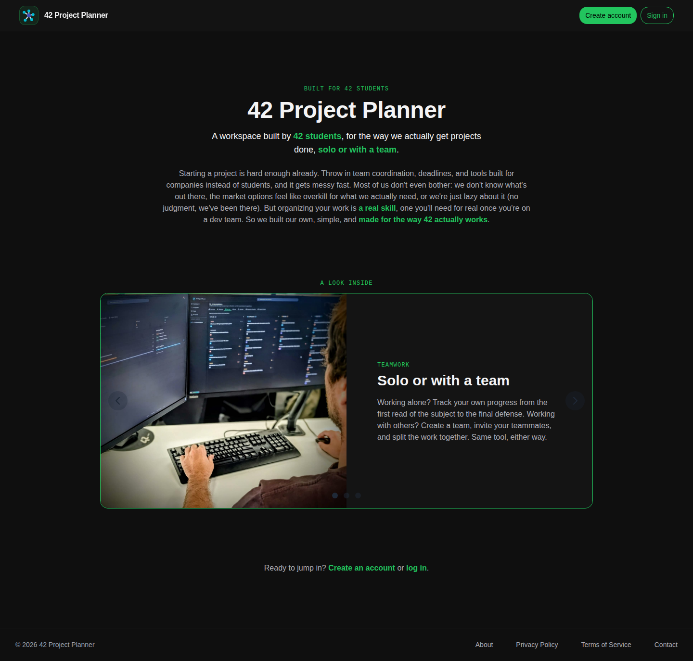

## Project summary

Task status, progress by category, upcoming events, defense readiness and team workload, all wired to real data.

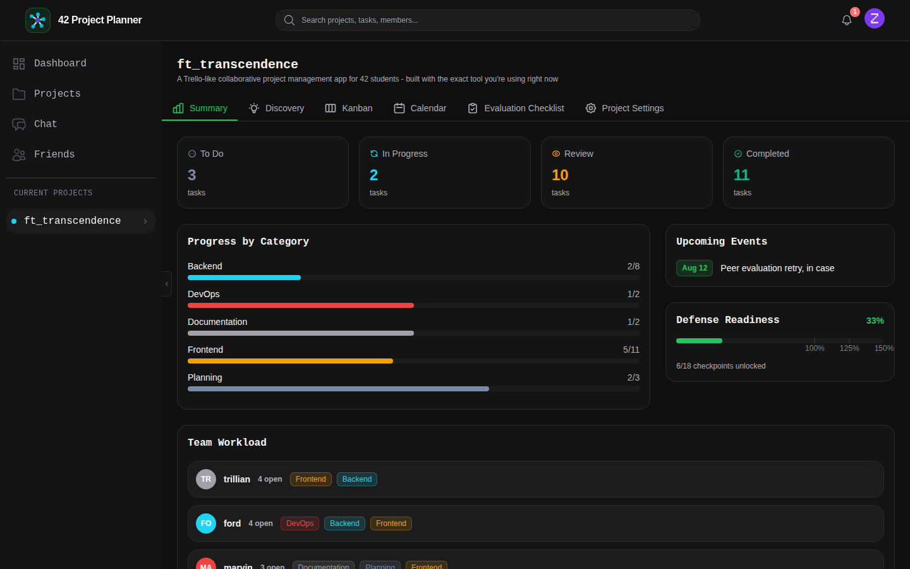

## Kanban board

Drag-and-drop tasks across To Do / In Progress / Review / Completed.

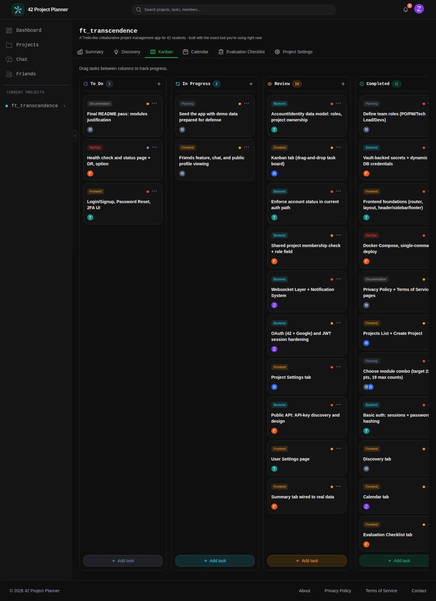

## Calendar

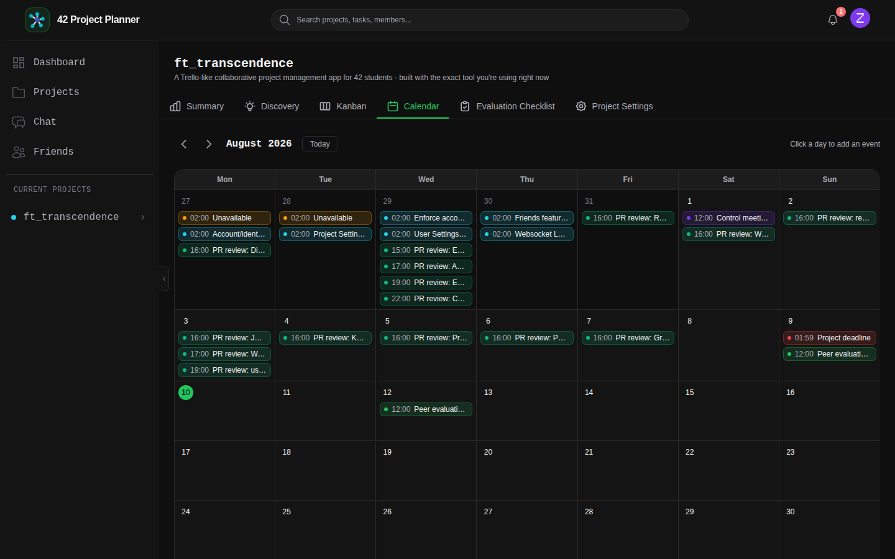

## Discovery

Break down the subject before writing code: constraints, questions, roadmap, resources, concepts.

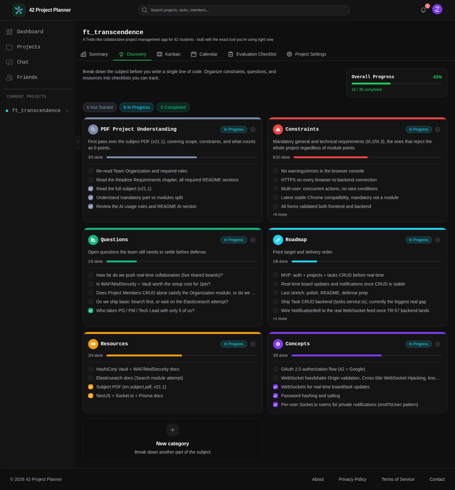

## Evaluation checklist

Track defense readiness against the subject's mandatory, bonus and supplemental items.

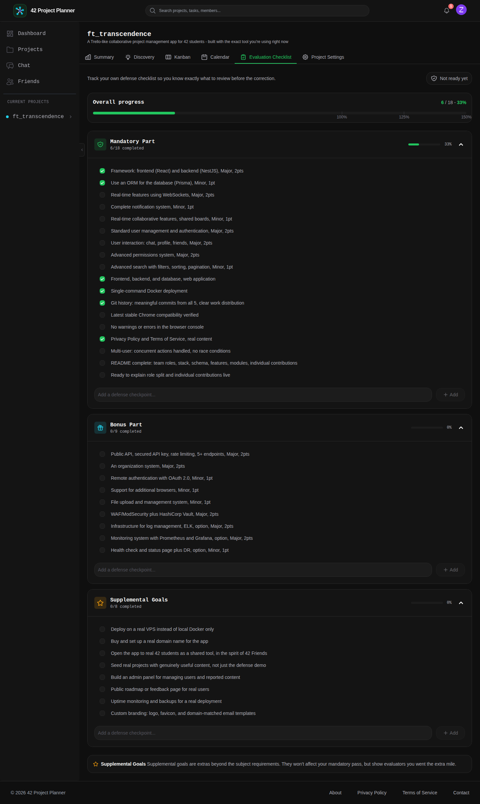

## Project settings

Manage members, roles, API tokens and project lifecycle.

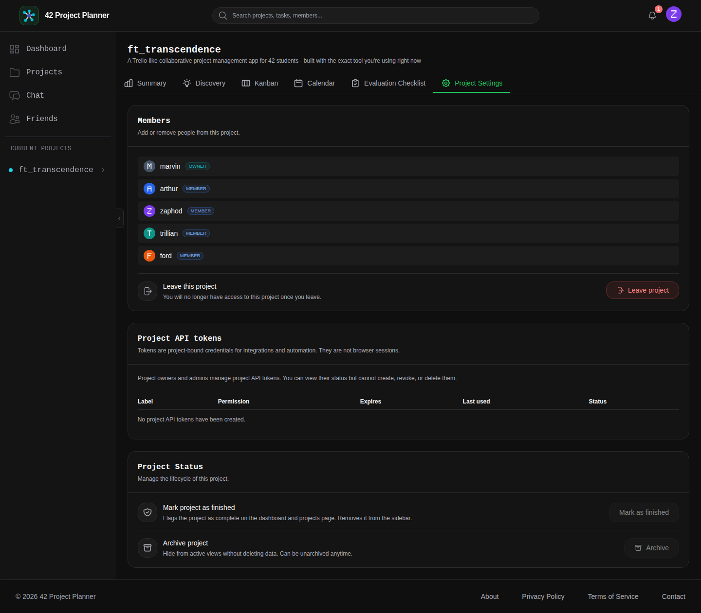

## User settings and profiles

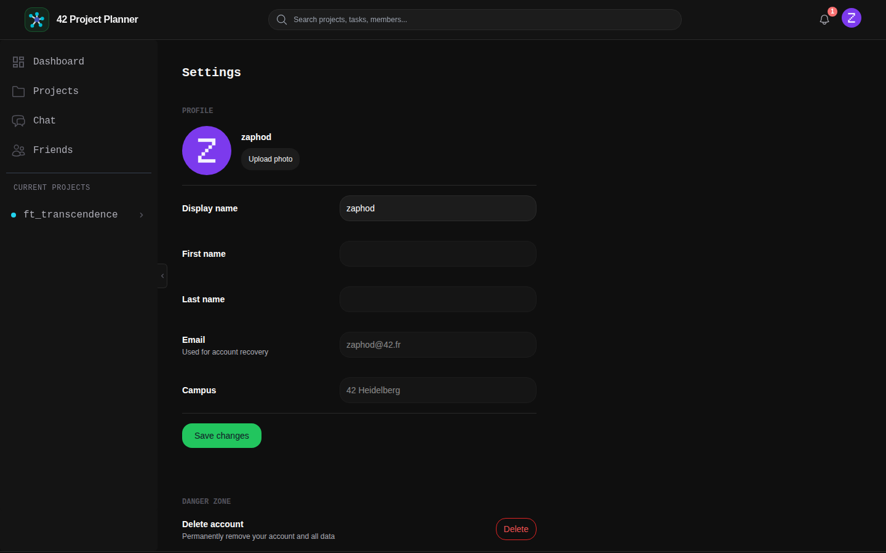

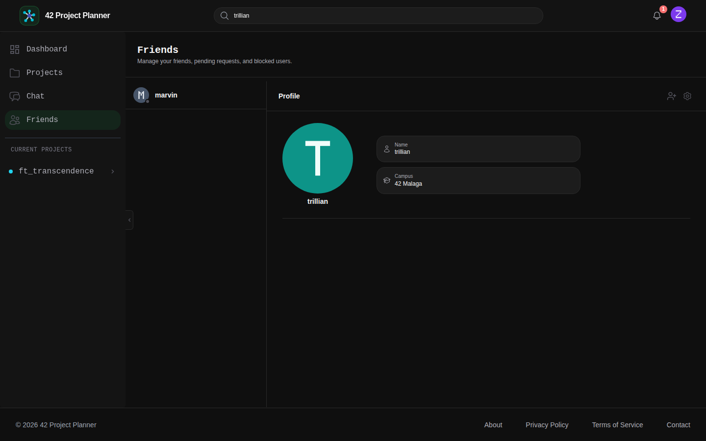

## Friends

Search for a teammate, view their profile, send and accept friend requests.

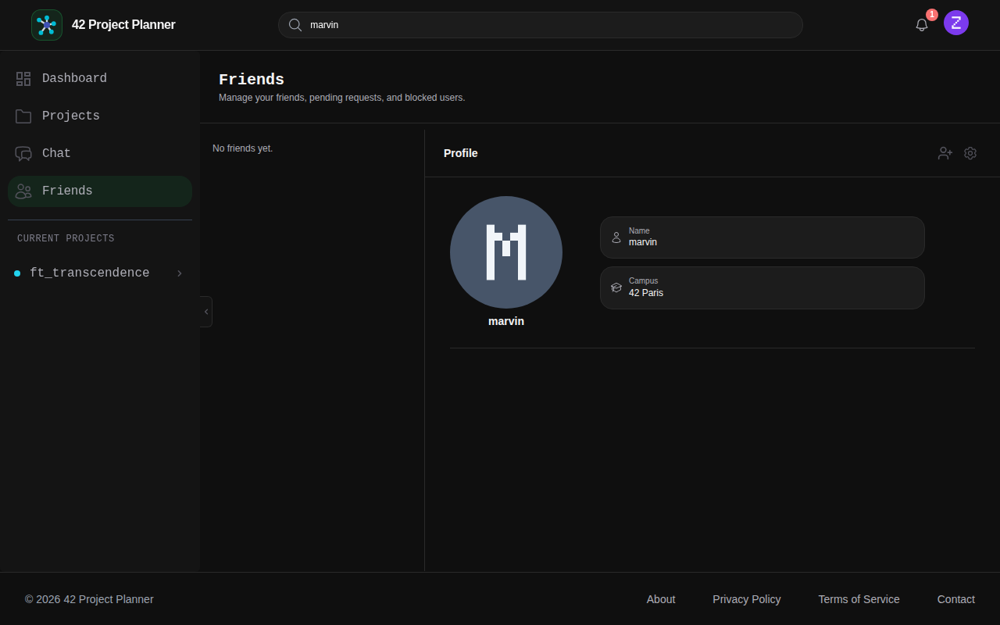

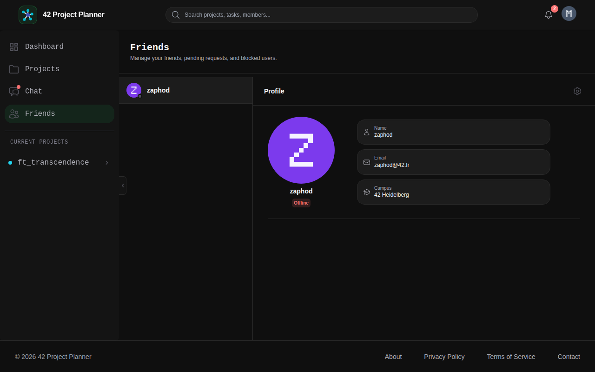

## Chat

Real-time group chat per project.

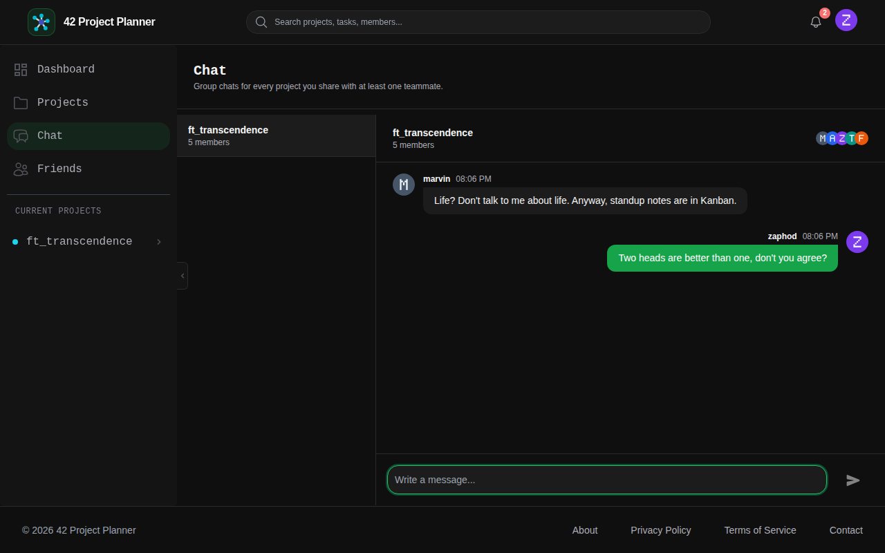
